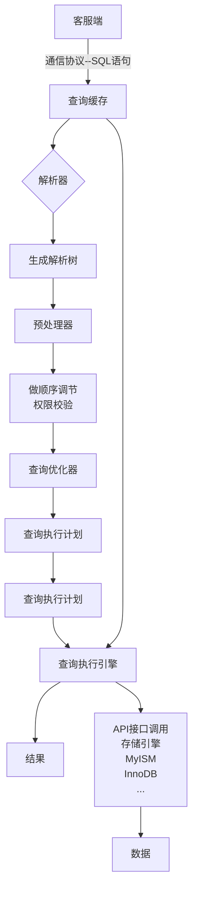

# MySQL性能优化

## 逻辑架构

可以清晰的查找各层次问题，降低工作量，提高问题解决效率。

### 连接层

不同的语言有不同的连接驱动，用于做数据库连接授权认证。

连接池:循环利用连接，提高性能，创建连接比较耗费性能，所以，数据库，FTP等等都应该有连接池，缓存的概念不外如是。

### 服务层

服务管理，安全，备份，复制，集群等，都属于这个模块。

操作数据库，增删改查，事务，视图等操作。

内部自带优化器，缓存等。

### 引擎层

存储引擎，最常用的有MyISAM，InnoDB

innodb中只能使用BTREE作为索引类型

MyISAM中只能使用HASH作为索引类型

### 存储层

存储与磁盘


## 存储引擎

采用不同的技术存储文件与数据，就形成了各种存储引擎。

show engines   -----查看存储引擎

列：

​	内存：速度快，但不能长期保存。

​	磁盘：相对较慢，但能长期保存。

### MyISAM与InnoDb

0：不支持

1：支持

|   功能   |                            MyISAM                            |                            InnoDB                            |
| :------: | :----------------------------------------------------------: | :----------------------------------------------------------: |
|  主外键  |                              0                               |                              1                               |
|   事务   |                              0                               |                              1                               |
|   行锁   |                              0                               |                              1                               |
|   表锁   |                              1                               |                              0                               |
|   缓存   |                    只缓存索引，不缓存数据                    |              对索引和数据都做缓存，内存消耗较大              |
|  表空间  |                              小                              |                              小                              |
|  关注点  |                             性能                             |                         相对下降一些                         |
| 默认安装 |                              1                               |                              1                               |
| 文件结构 | b.frm:描述表结构，字段长度<br />b.MYD(MYData):数据信息文件，存储数据信息(如果采用独立表存储模式)<br />b.MYI(MYIndex):索引信息文件 | b.frm:描述表结构，字段长度等。<br />b.ibd:存储数据信息和索引信息。 |

## SQL的执行顺序

### 代码编写顺序


### MySQL读取顺序


### 整体过程

1. 先对多表进行关系，更具条件找出符合条件的记录。

2. 在符合条件的基础上进行再次where条件筛选

3. 对筛选出来的内容进行分组操作。

4. 分组完成后，使用还having再次筛选出瞒住条件的记录。

5. 取所满足条件的记录。

6. 对取出的记录进行排序

7. 最终从取出的记录当中获取多少条记录显示出来。

## 链接查询

### 内链接

inner join

查询表的公有数据（公共字段）。

### 左右链接

left join

right join

取出左边或者右边的所有数据，再取出另一边符合条件的数据。

### 查询独有数据

数据基础上加上条件。

is null

is not null

### 全连接

俩表全部的信息。

Oracle中支持Full Outter,MySQL中不支持。

使用unio,把左右链接合并起来

```sql
select * A a left join B b on a.id = b.id
union
select * A a right join B b on a.id = b.id
```

查询两张表独有的数据也差不多，只需要查询每张表独有的数据即可。

## 优化分析

### 性能下降原因

执行时间变长，等待时间变长时，数据越多越明显，就是sql性能正在下降，应及时做出处理。

原因有几点：

- 语句问题：连接过多，子查询过多，导致没有用上索引

- 无效索引：建立索引后没有加以利用

- 使用过多join：和for嵌套类似，复杂度会变高

- 服务器配置：服务器配置和调优不合理，会导致各种情况，可以在服务器上和远程连接上执行相同sql做对比

### 解决概论

学习高质量sql，深入理解索引，保证在建立合理索引，使用索引时不失效。

合理利用引擎。

程序端不要使用太多重复的sql，尽量与传值方式或者引用方式使用。

合理使用缓存。

## 索引优化

### 索引概论

频繁查询，但相对较少更新可做索引。

索引往往以文件形式存储到磁盘上，索引也是一张表，保存了主键与索引字段。

为了加快数据的查找，可以维护二叉树，每个节点分别包含索引键值和一个指向对应数据记录的物理地址的指针，但最终还是使用的B+树。

#### 优势

- 一种数据结构，帮助mysql高效获取数据。
- 可以理解成字典。
- 排序，快速定位查找
- 提高效率，降低数据库IO成本，降低排序成本，降低CPU消耗。

#### 劣势

- 索引会导致插入更新变慢（会更新索引）
- 需要占用磁盘空间（类似动态规划，空间换时间）

### 索引分类

#### 单值索引

某一字段单独设置索引

一张表可以有多个单值索引

一般每张表不超出5个。

#### 唯一索引

每一行都是唯一，不能有重复的值

不能为空

主键自动建立唯一索引

#### 符合索引

多个字段关联到一起

#### 全文索引

字段内文字比较多，想使用关键字和列内容之间的相关度进行检索，可以利用全文索引来提高匹配的速度。

### 索引使用

查看表索引：show index from 表

#### 创建索引

create index `名称` on `表(字段)`

### 性能分析

#### 表设计

数据库设计的规整会避免很多不必要的麻烦，由此诞生了三范式，表拆分等规则，在任何一门语言里，设计规范用的好，在维护，迭代，交接都会大大提升效率。

#### 三范式

有些情况可以违反三范式（反三范式），例如某字段经常被用到，想日志统计时，如果多表连接查询明显消耗较大，这时，可以违反三范式。

##### 1NF

指数据库的每一列都是不可分割的基本数据项，同一列不能有多个值，这是关系型数据库的基本要求。

字段的值不可有多个，除非有特别意义。

##### 2NF

不能有重复的记录，解决方案有很多，设置主键，设置约束（主键是唯一约束）

主键必备

##### 3NF

一个数据表中不能包含已在其他表中已包含的非主关键字信息。

两张不要重负的字段，通常都是设置外键。

### 表拆分

在数据库中，一般不要设计属性过多的表，如果信息实在过多，可以拆分成小表，例如，富文本存储，必须要存储在数据库中的二进制文件，指纹信息，面部特征信息等等。。。

### DQL执行过程

#### 流程



#### 查询优化器

根据对数据表统计信息，进行综合查询，会在内部做出大量优化处理，让mysql自身做优化，可能会产生大量的IO，自己做的优化处理，就是让查询优化器按照我们的想法，帮我们选择最优的执行方案。

### 常见瓶颈

- CPU饱和
- 磁盘I/O读取数据大小（着重考虑）
- 服务器硬件拖后腿

### Explain

使用explain关键字，可以模拟优化器执行的sql语句，从而知道mysql是如何处理sql语句的，通过explain可以分析查询语句或表结构的性能瓶颈

#### 概论

- 查看表的读取顺序
- 数据读取操作的操作类型
- 查看哪些索引可以使用
- 查看哪些索引被实际使用
- 查看表之间的引用
- 查看每张表有多少行被优化器执行

#### 使用方法

在sql前加上explain

explain sql语句

#### 分析信息

id

相同，按顺序

不同，比较大小

大的先执行

#### select_type

##### 作用

查询类型，主要用于区别普通查询，联合查询，子查询等复杂查询。

##### 结果值

simple:简单查询

primary:有复杂的子查询，最外层被标记为primary

subquery:子查询

derived:衍生表，临时表，执行语句过程中产生的，例如分组时的临时表，就会被标记

union:连接查询时出现的

union result:也是临时表，只不过是连接查询产生结果的表

#### table

语句执行所属的表，临时表一般是<derived>

#### partitions

查询是基于分区表的话，会显示分区

#### type

访问类型排序

结果最好到最差

|   值   |                             意义                             |
| :----: | :----------------------------------------------------------: |
| system |               表中有一行记录，const类型的特列                |
| const  |          通过索引一次找到，只匹配一行数据，所以很快          |
| eq_ref |            多表查询，表中唯一索引相匹配（一对一）            |
|  ref   | 多表查询，返回匹配某个单独只的所有行（一对多，多对多，多对一） |
| range  |                           范围查找                           |
| index  |                     主键（唯一索引）查询                     |
|  ALL   |                      全体查询--需要优化                      |

一般基准达到range则可，ref为佳

#### possible_keys

key与keys主要作用，是查看是否使用了建立的索引，也即判断索引失效

在建立多个索引的情况，mysql最终用到了哪一个索引

#### key

实际使用的索引，为null则没有使用

查询中使用了覆盖索引，则该索引仅仅出现在key列表中

possible_keys与key关系，理论应该用到哪些索引，实际用到了哪些索引

覆盖索引查询的字段和建立的字段刚好吻合，这种我们称为覆盖索引

#### key_len

索引使用的字节数（可能使用的最大值）

#### ref

索引是否被引用，引用了哪几个索引

#### rows

越少越好

根据表统计信息及索引选用情况，大致估算出找到所需的记录所需要读取的行数

每张表有多少行被优化器查询过

#### filtered

越大越好，最高100

索引使用过滤比列

命中率

#### Extra

排序的详细信息

|            产生的值            |                             含义                             |
| :----------------------------: | :----------------------------------------------------------: |
| using filesort<br>需要立即优化 | 对数据使用一个外部索引排序，<br>而不是按照表内的所有顺序进<br>行排序,Mysql中无法利用所有<br/>完成排序操作称为“文件排序” |
|        using temporary         | 使用了临时表保存中间结果，<br>mysql在对查询结果排序时使<br>用了临时表。 |
|           use index            |                        使用了唯一索引                        |
|          using where           |                          使用了条件                          |
|       using join buffer        |                        使用了连接缓存                        |
|        impossible where        |                     where子句永远为false                     |

### 优化分析

#### 索引优化

##### 全值匹配

最好的匹配，使用到了所有索引。

##### 最佳左前缀法则

如果索引的多列。要遵循最左前缀法则，指的就是从索引的最左列开始，并且不跳过索引中的列。

跳过第一个，前两个都会导致索引失效。

跳过中间的，就算后面的使用，也只有前面几个索引有效。

顺序可以乱（预处理环节，调优时会调整顺序）。

##### 在索引列上做操作

在索引列上做计算，函数，类型转换会导致索引失效转向全表扫描。

##### 范围条件右边的索引失效

使用范围查询 >， <， >=， <=，like这些，会让右边的索引失效。

##### 使用不等于导致索引失效

使用!= ，<> 会导致索引失效，变为全表扫描。

##### 为空导致索引失效

使用is not null也无法使用索引。

一般使用索引的列都会有值，很少出现这种情况。

##### or导致索引失效

使用or时，也会导致所有索引失效。

##### 匹配不恰当

使用like，操作通配符时，把%放到开头，就会导致索引失效。

%在最前时，索引变得扑朔迷离，不能匹配。

当一个字符串字段匹配其他类型时，也会导致索引失效。

例如，一个person_name的字符串索引字段，使用条件时使用了person_name=99就会导致失效,使用person_name='99'则不会。

##### 解决方案

如果一定要使用上列操作，那就尽量使用覆盖索引。

以上的索引失效，大多为查询时使用*的情况。

##### 覆盖索引

建立的索引，刚好和查询的字段相吻合，这种我们称为覆盖索引

查询时，不要使用*获取字段信息，换成你想要的字段名（主要是索引字段）。

## 排序优化

### order by

使用order by时，经常出现using filesort（详情看explain的extra解析）

#### using filesort

当出现一升一降的排序 order by xxx desc, xxx asc，会出现这种情况。

出现此信息时，是因为无法利用索引进行排序，称为：文件排序，会单独出现个文件对该操作进行排序。

order by 做排序，**<u>顺序</u>**得和索引一样，不然会出现这种提示。

#### 优化方案

当where的条件有索引字段作为条件，在排序时可以不用在order by后面接这个字段，也不会出现using filesort。

### group by

前提是排序要得劲，排序出问题，分组也会嗝屁。

#### using temporay

和楼上的order by规矩差不多，但是要建立在排序成功的前提上。

## SQL技巧

收录一些好用的技巧

### 查询篇

#### exists与in

select * from table where exists (select * from order where user.id = order.user_id)

exists会先查前面的表（user)  然后再和后面的表（order）关联筛选出结果

select * from table where in (select user_id from order)

in会先查后面的表（order)然后再和前面的表（user）关联筛选出结果

 

所以外层的表数据量大的时候使用in，反之则用exists

### 插入篇

#### replace

一般这玩意是用来替换字符串的，但在mysql中有其他用法。

可以用来插入数据，如果不存在此主键，则插入此记录，如果存在，则替换，免掉了后端再次判断的麻烦，同时也避免插入重复数据的麻烦。

插入数据的表必须有主键或者是唯一索引！否则的话，replace into 会直接插入数据，这将导致表中出现重复的数据。

### 更新篇

```sql
update  table1 t  set t.column1 =0 where t.id in (select id from table2)  
-- 改为下列会好很多
update table1 t ,table2 b set t.column1=0 where t.id=b.id  

```

### 删除篇