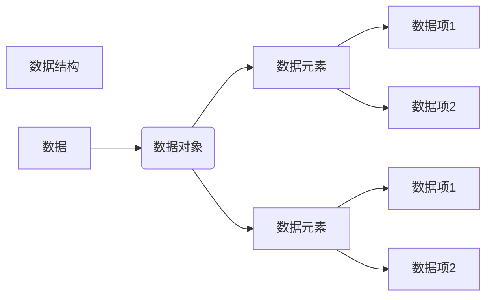

# 数据结构与算法

## 简介

### 数据

描述客观事物的符号，是计算机中<u>可以操作的对象</u>，是能被计算机识别，并输入给计算机处理的<u>符号</u>集合。

可以输入到计算机，能被计算机处理。

### 数据元素

组成数据的，<u>有一定意义的基本单位</u>，在计算机中通常作为整体处理，也被称为记录。

### 数据项

一个数据元素，由若干数据项组成。

有不可再分的特性。

### 数据对象

性质相同的数据元素的集合，<u>是数据的子集</u>。

### 数据结构

不同数据元素之间不是独立的，而是存在特定的关系，我们将这些关系称之为数据结构。 

数据结构是相互之间存在一种或多种特定关系的数据元素的集合。

## 数据结构

### 逻辑结构

#### 集合结构

集合结构中的数据元素同属一个集合

数据元素相互之间没有其他关系

#### 线性结构

数据元素之间是一对一的关系。

#### 树形结构

元素之间存在一对多的层次关系

#### 图形结构

元素之间多对多的关系

### 物理结构

物理结构又叫存储结构，<u>是指数据的逻辑结构在计算机中</u>的存储形式。

数据的逻辑关系和物理关系一致。

#### 顺序存储结构

把数据元素存储在地址连续的存储单位里。

#### 链式存储结构

把数据元素存放在任意的存储单元里。

### 数据类型

内存空间是有限的，利用数据类型可以实现，如何更好的利用内存空间。

数据类型是指一组性质相同的值的集合及定义再此集合上的一些操作的总称。

#### 原子型

不可以再分解的基本类型，像整型，实型，字符型等。

#### 结构型

由若干个类型组合而成，是可以再分解的，例如，整型数组是由若干整型数据组成的。

#### 抽象数据类型

是对已有的数据类型进行抽象。

抽象数据类型是指一个数据模型及定义再该模型上的一组操作。